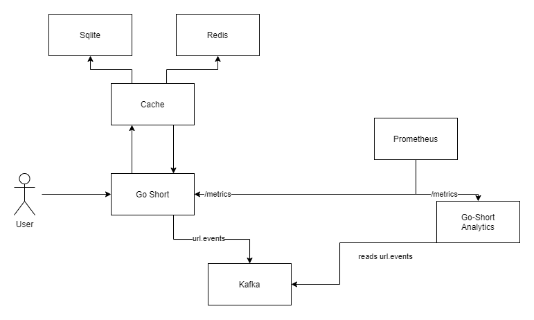

# GoShort

`GoShort` is a project I am working on for education purposes. It takes your URL and generates an alias, which is 
user to redirect to real page on access.

This project uses `SQLite` as storage and `Redis` for url aliases caching, but it is possible to implement other data sources.


# Getting started

Download Docker Desktop for Mac or Windows. Docker Compose will be automatically installed. On Linux, make sure you have the latest version of Compose.

Run in this directory to build and run the app:

```shell
> docker compose up
```

To stop

```shell
> docker compose down --volumes
```


# API

Service accepts web url and creates an alias for it. Alias is `base64` encoded slice of sha-512 hash with some additional 
information to guarantee more uniqueness.

## Create short link
```shell
> curl
    --header `Content-Type: application/json` 
    --data '{
        "url":"https://www.example.com"
    }'
```

On success HTTP 200 OK response with JSON data containing link is returned:
```json
{
  "ok": true,
  "alias": "http://localhost:8080/n6aio0bCCgU"
}
```

On errors HTTP 200 or 500 is returned. Error responses have `Content-Type: application/problem+json` header set.
```json
{
  "ok": false,
  "description": "invalid url"
}
```

## Get short link

We can use generated link from previous response

```shell
> curl http://localhost:8080/n6aio0bCCgU
```

On success server replies with HTTP 302 Found with `Location: https://www.example.com` header set.

Errors handling is the same as in link creation. Server replies with HTTP 200 or 500 with `Content-Type: application/problem+json` set.

## Access analytics

The application collects Prometheus metrics. It is accessible on `localhost:9090` by default.
Collected metrics:
- Length of the shortened url `goshort_metric_url_len`
- Number of accesses to alias `goshort_metric_total_url_request`
- Number of API accesses to `Go-Short` `goshort_api_request`
- Timings of API accesses to `Go-Short` `goshort_api_request_duration`
- Database timings: read-lock and write-lock waiting times `persist_sqlite_lock_wait_time`

# Architecture



- A [Go API](cmd/go-short) that accepts POST and GET requests
- A [Go cache microservice](cmd/cache) that retrieves cached urls from Redis, or from main storage 
- A [Go analytics microservice](cmd/short-analytics) that tries to read analytic events from the Kafka
- Prometheus metrics server
- Kafka used for collecting events